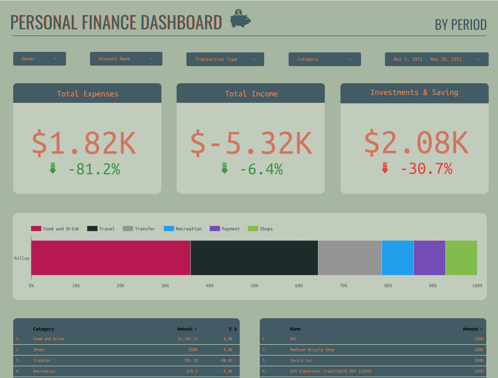
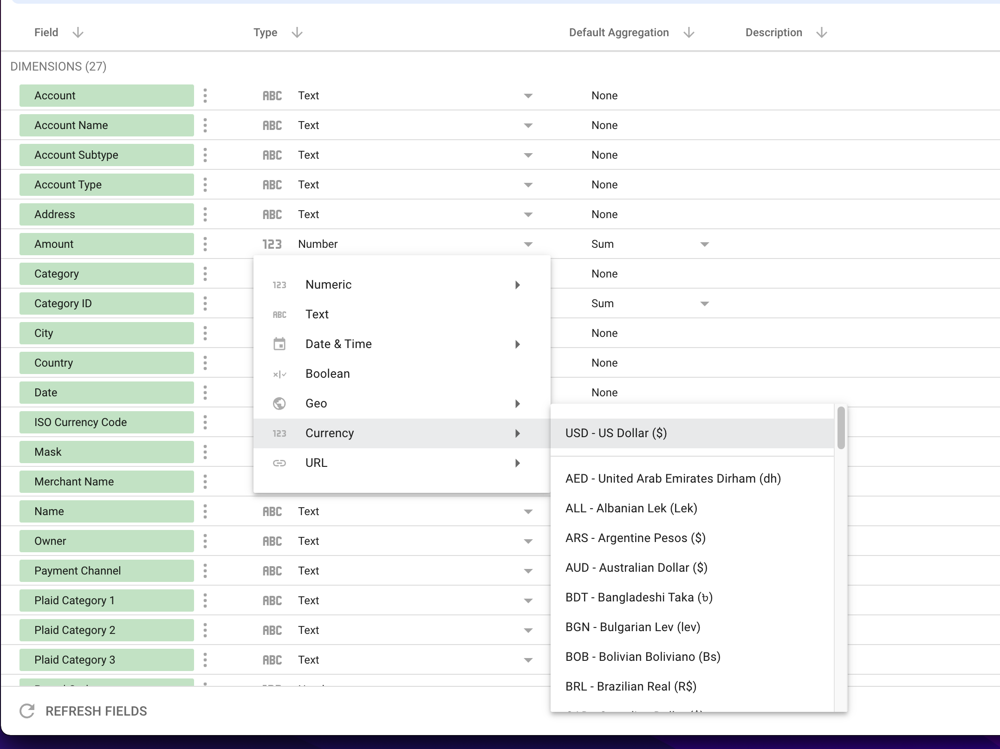

# Overview

I tried out some of the personal finance apps like Mint and Personal Capital. They were great, but I'm picky with the way I do manage my finances and I would get frustrated with not being able to get everything exactly the way I like it. I also didn't like the idea of my financial data being sold to advertisers. So I decided that I had to build my own solution.

This system uses Plaid ([they do not sell data to advertisers](https://news.ycombinator.com/item?id=18655417)), Google Sheets, and Data Studio. You'll need a Plaid Developer account as well as a Google account. You don't need to know how to code to use this, but you do need to be able to use the command line to get the Quickstart app up and running and be comfortable changing some variables in the config file.

This project was inspired by [this repo](https://github.com/hirefrank/plaid-txns-google-sheets/blob/master/Code.gs) by hirefrank

# Features

- Automatically import transaction and account balance data from any account available in Plaid (Import Latest Transactions)
- Import plaid API data between a specific date range (Import Date Range)
- Easily import reports from other accounts that are not available in Plaid (Import Other Accounts)
- Build rules to transform imported transactions

# Set up

## Get your access_tokens

1. You'll first need to create a Plaid Developer Account. Don't worry that you aren't creating real fintech app with this account, even the Plaid founder [has said he's used this method to pull data into Google Sheets for his personal projects](https://stackoverflow.com/questions/49868037/integrating-plaid-and-google-apps-script).
2. Once you have that account set up, you'll need to boot up the Plaid Quickstart app on your machine. You can find those instructions [here](https://plaid.com/docs/quickstart/).
3. Boot up Quickstart and then use Plaid Link to connect to one of your bank accounts. Once you're connected, the Quickstart app will show your access_token.

## Set up the Google Sheet

1. Copy [this google sheet](https://docs.google.com/spreadsheets/d/1d60g7UmSDV08VCtZAY5csPhTiRg6J1AdVuNEFb3993g/edit#gid=340231135).
2. In the sheets menu, go to Extensions -> Apps Script
3. In the Apps Script editor, go to `config.gs`. Plug in your plaid credentials into the file. You can use multiple accounts & access tokens, just follow that format.
   
4. In the sheet menu, you should see "Plaid API Ingest". Run one of the functions, it will open a permissions pop up. Accept the permissions.
5. You should now be able to run either "Ingest Latest" or "Ingest Date Range". I recommend pulling all of your historical data, think about what transformation rules you may want to set up (something like: If "Name" contains "Coinbase", change "Category" to "Crypto"). Once you have the rules set up, clear the data and pull it in again so that the rules are applied. More about rules in the section below.

## Applying Transformation Rules

Transformation rules make it really easy for you to modify incoming data to your liking. It's best used for recategorizing or changing the transaction type of your data. You can use AND/OR logic with various operators.

Transformation rules are applied automatically any time data is imported, whether that is importing the latest transactions, importing by date range, or manually importing a report.

You can set up your own rules in the "Rules" tab.

Things to note:

- Transformation rules are NOT applied retroactively to the data once it is in the Transactions tab. This is so you can go in and recategorize historical data without the rules overwriting your changes.
- You only need to use AND/OR logic if you are using multiple conditions
- You do not need to put anything in the IF column! That's just there so it makes more sense when you read the logic
- For manual reports, use the corresponding header in the Transactions (Running) sheet and NOT the header in the report you are importing.

## Ingesting data outside of the Plaid API

You can easily ingest other credit card reports that are not accessible via Plaid's API. The example sheet contains an example using an Apple Card report.

Instructions:

1. Create a new tab with the tab name in the following syntax: "Ingest Account Name", replacing "Account Name" with your account.
2. Go to the Account Header Map tab and add in a new row. In column A, make sure to put the same "Account Name" you used for the tab name. The program will match this data based on that string, so make sure its an exact match.
3. The top row in the Account Header Map tab is the schema used in the Transactions (Running) tab. Match each header in the report you are importing to one of these headers. It's likely that there are more columns in the Transactions (Running) tab than the report you're ingesting. Instead of matching a header in your report, you can put a default value instead.

Ingest rules will still be applied to this data, but you'll use the respective Transaction header instead of the report you are importing. For example, if Apple Card uses "Description" instead of "Name", you'll still use something like: If "Name" contains "McDonalds", transform "Category" to "Fast Food").

## Connecting to Data Studio

Note: There's a second page on the sheet with time series charts! The data in the screenshot looks silly because it's from the Plaid API sandbox account.

1. Make a copy of [this report](https://datastudio.google.com/reporting/cb8b8470-309f-47ef-8157-ff331d0323f6)
2. After you click "Make a copy", there will be a window that allows you to select a new data source. Click create data source -> Google Sheets -> Then connect it to the Transactions (Running).
   
   Protip: You should change the format of "Amount" to be USD so all your charts will automatically have $ signs.
3. It should be good to go, but sometimes metrics on the chart get a little messed up when you switch data sources. If you see any chart that is not loading or the data looks wrong, click into it and change the metric to Amount.

## Setting up automated imports using triggers

You can use triggers to pull in recent transactions and account balances every day.

1. Go to Extensions-> Apps Script
2. In the menu on the left, click the clock icon
3. Add trigger
4. Choose `importLatest` as the function to run
5. Select time-driven as the event source
6. Set the time you'd like

# FAQ

**Q: Why is there an "Owner" field?**

A: My girlfriend and I manage our finances together, so we use this to import our accounts together. Owner helps us differentiate. You can delete it if you want (following instructions above), but I'd recommend leaving it because it might come in handy some day.

**Q: What is "Rollup" column?**
A: It makes it easier to aggregate data for some charts in data studio.

**Can I edit the columns?**
A: Yes you can! You just need to update the headers in the config file and then update the mapping in `cleanTransactions` in utils.js

**Can I edit the sheet names?**
A: Yep! Just update them in the config file after you update them in the sheet.
